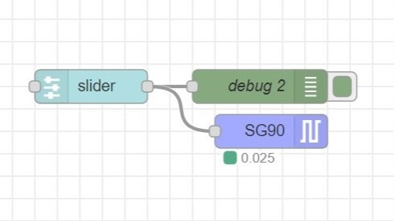

# node-red-mcu-servo

## OverView

Node-RED MCU pluginに追加できる、サーボモーター用のノードです。

## How to install

※Raspberry Pi環境での実行を想定しています。  

1. Node-RED MCUの環境を構築します。  

2. リポジトリをクローンします。  

```
$ cd ファイルのパス
$ git clone https://github.com/404background/node-red-mcu-servo.git
```

3. npmでパッケージをインストールし、node_types.jsonを編集します。  

```
$ cd .node-red
$ sudo npm install ファイルのパス
$ cd .node-red/node_modules/@ralphwetzel/node-red-mcu-plugin/node-red-mcu
$ sudo nano node_types.json
```
"lower-case"を参考に、  
```
"servo": "manifest.jsonのパス",  
```
を追加します。  

4. Node-REDを再起動します。  

```
$ sudo systemctl restart nodered.service
```

## Test Case

角度を受け取って、Servoノードに渡すようにしています。  
  

パルス幅、周期、角度の初期値はSG90に合わせています。  
  

スライダーは0~180に設定しています。  


スライダーに合わせて、サーボモーターが回転します。  

[](https://youtu.be/pjDmG1Ae03I)

## LINK

Node-RED-MCU：
<https://github.com/phoddie/node-red-mcu>  
Moddable SDK：
<https://github.com/Moddable-OpenSource/moddable>  
Node-RED「はじめてのノード開発」：
<https://nodered.jp/docs/creating-nodes/first-node>  
Qiitaに書いた記事：
<https://qiita.com/background/items/9b820251aa9dda5a3167>  
ホームページに書いた記事：  
<https://404background.com/program/node-create-2>  
